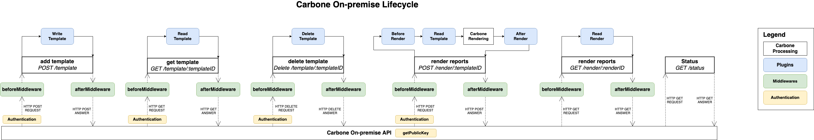

Carbone On-Premise Documentation
============================
## Table of content

- [Installations](#installations)
  - [Basic install](#basic-installation)
  - [Systemd install](#installation-from-systemd)
  - [Install LibreOffice and why?](#how-and-why-install-libreoffice)
  - [Docker CLI install](#installation-from-docker-cli)
  - [Docker Compose install](#installation-from-docker-compose)
- [Carbone Options overview](#carbone-options-overview)
  - [CLI](#cli-options)
  - [Environment variable](#environment-variable-options)
  - [Configuration file](#configuration-file-options)
- [How to use Carbone On-premise?](#how-to-use-carbone-on-premise)
- [Customise Carbone On-premise](#customise-carbone-on-premise)
  - [Plugins](#plugins)
  - [Middlewares](#middlewares)
  - [Carbone Studio Light](#carbone-studio-light)

## Installations

Carbone On-premise can be installed in different ways:

  - Self-contained binary executable + external LibreOffice (used for conversion)
  - Docker container (Libre Office is included)
  - Debian/Ubuntu package (coming soon)

### Basic Installation

1. Download the license and the Carbone On-premise binary for server/OS: Mac, Linux or Windows
2. Install LibreOffice (Optional). [Link to instructions](#How-and-why-install-LibreOffice?).
3. Prepare the license key to be loaded, multiple solution:
   - Set the Environment Variable `CARBONE_EE_LICENSE` with the license key as the value
   - Or pass the CLI option `--license` followed by the license key as the value when you start the server (step 4)
   - Or insert the **license** file in the "config" directory. If the directory doesn't exist, it must be created next to the Carbone On-premise binary. If multiple licenses are available, only the latest license is selected. The binary can't start if the license is outdated or invalid.
4. Start Carbone web server or [daemonize it with systemd](#installation-from-systemd-(Ubuntu/Debian-ONLY)). It is possible to pass [options](#carbone-options-overview) to Carbone On-Premise through the CLI:

```bash
  ./carbone webserver --port 4000 --workdir .
```

If an error appears during the start up, you must verify:
- if your license is valid
- if CLI options and values are valid

You must install LibreOffice to generate PDF documents, [read instructions](#how-and-why-install-libreoffice).

### Installation from systemd

> Working only for Ubuntu or Debian.

Carbone On-Premise contains automatic installation scripts to daemonize with systemd. It has been carefully configured to provide a high level of security.


```bash
  # Generate installation scripts
  ./carbone install
  # Execute installation scripts and follow instructions
  sudo ./install.sh
```

The service is configured to run with "carbone" user (automatically created) in the "/var/www/carbone-ee" directory.
It is possible to overwrite values through environment variables `CARBONE_USER` and `CARBONE_WORKDIR`.

You must install LibreOffice to generate PDF documents, [read instructions](#how-and-why-install-libreoffice).
## How and why install LibreOffice?
#### on OSX

- Install LibreOffice normally using the stable version from https://www.libreoffice.org/

#### on Ubuntu Server & Ubuntu desktop

> Be careful, LibreOffice which is provided by the PPA libreoffice/ppa does not bundled python (mandatory for Carbone). The best solution is to download the LibreOffice Package from the official website and install it manually:

```bash
  # remove all old version of LibreOffice
  sudo apt remove --purge libreoffice*
  sudo apt autoremove --purge

  # Download LibreOffice debian package. Select the right one (64-bit or 32-bit) for your OS.
  # Get the latest from http://download.documentfoundation.org/libreoffice/stable
  # or download the version currently "carbone-tested":
  wget https://downloadarchive.documentfoundation.org/libreoffice/old/7.1.5.2/deb/x86_64/LibreOffice_7.1.5.2_Linux_x86-64_deb.tar.gz

  # Install required dependencies on ubuntu server for LibreOffice 7.0+
  sudo apt install libxinerama1 libfontconfig1 libdbus-glib-1-2 libcairo2 libcups2 libglu1-mesa libsm6

  # Uncompress package
  tar -zxvf LibreOffice_7.1.5.2_Linux_x86-64_deb.tar.gz
  cd LibreOffice_7.1.5.2_Linux_x86-64_deb/DEBS

  # Install LibreOffice
  sudo dpkg -i *.deb

  # If you want to use Microsoft fonts in reports, you must install the fonts
  # Andale Mono, Arial Black, Arial, Comic Sans MS, Courier New, Georgia, Impact,
  # Times New Roman, Trebuchet, Verdana,Webdings)
  sudo apt install ttf-mscorefonts-installer

  # If you want to use special characters, such as chinese ideograms, you must install a font that support them
  # For example:
  sudo apt install fonts-wqy-zenhei
```

#### Why?

Carbone uses efficiently LibreOffice to convert documents. Among all tested solutions, it is the most reliable and stable one in production for now.

Carbone does a lot of thing behind the scene:

- starts LibreOffice in "server-mode": headless, no User Interface loaded
- manages multiple LibreOffice workers to maximize performance (configurable number of workers)
- automatically restarts LibreOffice worker if it crashes or does not respond
- job queue, re-try conversion two times if something bad happen

### Installation from Docker CLI

> Installing Carbone On-premise with docker doesn't need LibreOffice to be installed, it is already included on the Docker image.

Build the image with the command:
```sh
$ docker build --platform "linux/amd64" -t carbone-ee:latest .
```
Then start the container:
```sh
$ docker container run --name carbone-ee -p 4000:4000 --platform linux/amd64 --volume=/var/tmp/key:/key --env CARBONE_EE_LICENSEDIR=/key --entrypoint ./carbone-ee-linux carbone-ee:latest webserver
## For background mode, add the -d option
```
The server is listening by default on `http://localhost:4000`. To change configuration, add [CLI options](#cli-options) at the end of the command.

Stop the container:
```
docker stop carbone-ee
```
Remove the container:
```
docker container rm carbone-ee
```


### Installation from Docker Compose

> Installing Carbone On-premise with docker doesn't need LibreOffice to be installed, it is already included on the Docker image.

Open a terminal where the `Dockerfile` and the `docker-compose.yml` are located.

Start the server with the command:
```sh
$ docker-compose up
## For background mode, add the -d option
```
The server is listening by default on `http://localhost:4000`. To change configuration, add [CLI options](#cli-options) on the `docker-compose.xml`.


Command to stop the container without removing it:
```sh
$ docker-compose stop
```
Command to stop the container and removes the container, networks, volumes, and images created by up:
```sh
$ docker-compose down
```
Discover more commands by reading the [docker-compose CLI overview](https://docs.docker.com/compose/reference/).


## Carbone Options overview

Carbone default parameters can be overwritten through:

- [CLI options](#CLI-options) (highest priority)
- [Environment variable](#Environment-variable-options)
- [Configuration file](#Configuration-file-options) (lowest priority)

If an option is reported in different places, CLI options are picked in priority, then environment variables in second place, and finally the configuration file.

### Options list

| Options        | Default Values    | Description                                                  |  CLI options |  ENV |
| -------------- | ---------------- | ------------------------------------------------------------ | ------------ | ---- |
| port           | 4000             | Service PORT                                                 | --port / -p  | CARBONE_EE_PORT |
| workdir        | Actual directory | Define the place to store elements,  it creates 6 directories:<br />- `template`  : where carbone keeps templates (cache)<br />- `render`    : temp directory where report are generated,<br />- `asset`     : internal used only, <br />- `config`    : config, licenses and ES512 keys for authentication,<br />- `logs`      : [NOT IMPLEMENTED YET] formatted output logs,  and<br />- `plugin `   : where to put custom plugin | --workdir / -w | CARBONE_EE_WORKDIR  |
| licenseDir     | "config/"        | Absolute directory path to licenses | --licenseDir / -L |  CARBONE_EE_LICENSEDIR |
| license        |                  | License as a string, if the option is used, `licenseDir` option is skipped | --license / -l | CARBONE_EE_LICENSE |
| factories      | 1                | Multithread parameter, number of LibreOffice converter       | --factories / -f |  CARBONE_EE_FACTORIES |
| attempts       | 1                | If LibreOffice fails to convert one document, `attempts` options set the number of re-try | --attemps / -a | CARBONE_EE_ATTEMPTS  |
| authentication | false            | [Authentification documentation at the following link](#authentication-option) | --authentication / -A |  CARBONE_EE_AUTHENTICATION |
| studio         | false            | Web interface to preview reports. [Learn more.](#carbone-studio-light)                             | --studio / -s | CARBONE_EE_STUDIO |
| studioUser         | admin:pass  | If the authentication option is enabled, the browser requests an authentication to access the web page. Credentials have to be formated, such as: `[username]:[password]`.                             | --studioUser / -S | CARBONE_EE_STUDIOUSER |
| maxDataSize         |  60MB  | Maximum JSON data size accepted when rendering a report, the value must be **bytes**. Calcul example: 100 * 1024 * 1024 = 100MB | --maxDataSize / -mds | CARBONE_EE_MAXDATASIZE |
| templatePathRetention         | 0            | Template path retention in days. 0 means infinite retention. | --templatePathRetention / -r | CARBONE_EE_TEMPLATEPATHRETENTION |
| lang         | en            | Locale language used by Carbone | --lang / -l  | CARBONE_EE_EN |
| timezone         | Europe/Paris  |  Timezone for managing dates | --timezone / -t | CARBONE_EE_TIMEZONE |
| currencySource         |   |  Currency source for money conversion. If empty, it depends on the locale. | --currencySource / -cs | CARBONE_EE_CURRENCYSOURCE |
| currencyTarget         |   |  Currency target for money conversion. If empty, it depends on the locale. | --currencyTarget / -ct | CARBONE_EE_CURRENCYTARGET |
| currencyRates          | `{ EUR : 1, USD : 1.14, ... }` | Currency rates, it is based on EUR which should be equals to "1". The option can only be set on the `config/config.json` file. |  | |
| translations          | `{}` | Translation object loaded at startup. It can be overwritten by rendering requests. The option can only be set on the `config/config.json` file.  |  | |
| converterFactoryTimeout  | 60000  | Maximum conversion/socket timeout for one render (unit: ms) |  | CARBONE_EE_CONVERTERFACTORYTIMEOUT |


### CLI options

To list available options, run the help command, such as:

```bash
./carbone webserver --help
```

Here is an example of passing options to the service:

```bash
./carbone webserver --port 4001 --factories 4 --workdir /var/www/carbone --attemps 2 --authentication --studio
```

### Configuration file options
To use a configuration file, `config.json` must be created in the `config` folder. Here is an example of a configuration:
```json
{
  "port": 4001,
  "bind": "127.0.0.1",
  "factories": 4,
  "attempts": 2,
  "authentication": true,
  "studio" : true,
  "studioUser" : "admin:pass" // login:password if authentication is active
}
```

### Environment variable options

Environment variables can be used to define options, the name has to be uppercased and has to start with the prefix "`CARBONE_EE_`", such as:

```bash
export CARBONE_EE_PORT=3600
export CARBONE_EE_BIND=127.0.0.1
export CARBONE_EE_FACTORIES=4
export CARBONE_EE_WORKDIR=/var/www/carbone
export CARBONE_EE_ATTEMPTS=2
export CARBONE_EE_AUTHENTICATION=true
```


### Authentication option

By default, carbone-ee starts without authentication.
To activate it, the option `--authentication` must be added through the CLI or set `authentication : true` in a configuration file. When activated, all APIs are protected by authentication except `GET /render.carbone.io/render/:renderId` and `GET /status`.


Why `GET /render.carbone.io/render/:renderId` is not protected?
  - `:renderId` contains the custom report name in base64, concatenated with a 22-characters-long Cryptographically Secure Pseudo-Random Number with unbiased (ie secure) tranformation. It is somehow a unique password for each rendered report. It is better than any authentication mechanism.
  - `:renderId` is ephemeral, the resource becomes inaccessible once the file is downloaded.
  - The report can be easily downloaded in any browsers / reverse-proxy / application without complex authentication mechanisms

The authentication mechanism is based on `ES512` JWT tokens.

The token must be passed in `Authorization` header exactly like the SaaS version https://carbone.io/api-reference.html#choose-carbone-version

#### How to generate tokens ?
  1) with Carbone CLI: `./carbone generate-token` generates 40-years valid tokens
  2) programmatically and dynamically on client side to reduce Man-In-The-Middle attacks with short expiration dates. More information below.

You can generate and renew tokens on client side using standard libraries in any programming languages https://jwt.io/

Tokens must contain at least this payload. And it must be signed with the generated public key in `config/key.pub` (ES512)
```
{
  "iss": "your-carbone-user",
  "aud": "carbone-ee",
  "exp": 2864189447
}
```

We recommend to generate tokens with an expiration date valid for at least 12 hours to avoid consuming to much computer resource on both side clients and Carbone servers. If the client is a NodeJS program, [Kitten JWT](https://github.com/Ideolys/kitten-jwt) can be used which does the token renew automatically.

## How to use Carbone On-premise?

Carbone On-Premise works the same way as Carbone Render API, the endpoints list:
- Add a template    : POST /template
- Get a template    : GET /template/:templateId
- Delete a template : DELETE /template/:templateId
- Generate a report : POST /render/:templateId
- Get the result    : GET /render/:renderId
- Get status        : GET /status

[Click here to learn more about the API.](https://carbone.io/api-reference.html#carbone-render-api.)

For testing in few minutes, copy and past [CURL command example](https://carbone.io/api-reference.html#carbone-render-curl) on your terminal.

For an easy and fast integration, SDKs are available [on Github](https://github.com/carboneio?q=sdk) to request the API in multiple languages (Node, Go, Python, PHP, ...).

## Customise Carbone On-premise

Carbone On-premise gives the possibility to override functions at specific moments to add custom features, such as adding analytics, store data on a specific storage provider, custom authentication, etc... It is possible through:
- [**Plugins**](#Plugins): Functions to manage file storage, authentication, analytics, logs, or custom behaviors.
- [**Middlewares**](#Middlewares): Functions that are fired before or after HTTP requests. It can be useful for logging, statistics, or custom behaviors.


For a better understanding, here is the Carbone On-premise lifecycle:



Last important **requirement**, plugins and middlewares can be only written using NodeJS.

### Plugins

Following elements can be overrided:

- [Write template](#Override-write-template)
- [Read template](#Override-read-template)
- [Delete template](#Override-delete-template)
- [Write render](#Override-write-render)
- [Read render](#Override-read-render)
- [Before/After render](#Before/After-Render)
- [Authentication (Get Public Key)](#Authentication-(Get-Public-Key))

To override them, it is recommended to create a separate NodeJS repository.

```bash
# Create a separate folder
mkdir carbone-on-premise

# Initialize a node repository
npm init

# Move the carbone binary inside this folder
mv /path/to/carbone/binary ./carbone
```

When Carbone On-premise is executed for the first time, default folders are created automatically ([explanation here](#Carbone-Options-overview)). Custom plugins should be inserted in the `plugin` folder.

### Override template storage

To override template storage, create the file `storage.js` in the `plugin` folder.
It will be possible to upload your template into an Object Storage, S3 API or other storage systems.
Export a function called `writeTemplate` with 5 arguments:
- `req`: The req object represents the HTTP request and has properties for the request query string, parameters, body, HTTP headers, and so on.
- `res`: The res object represents the HTTP response that a server sends when it gets an HTTP request
- `templateId`: Unique template ID as a sha256 hash
- `templatePathTemp`: Absolute path of the uploaded template
- `callback`: callback function

Additional file informations are available the request header:
- `req.headers['carbone-template-extension']`: file extension (eg: 'xml')
- `req.headers['carbone-template-mimetype']`: file mimetype (eg: 'application/xml')
- `req.headers['carbone-template-size']`: file size in bytes

```js
const fs = require('fs');
const path = require('path');
const os = require('os');

function writeTemplate (req, res, templateId, templatePathTemp, callback) {
  fs.rename(templatePathTemp, path.join(os.tmpdir(), 'PREFIX_' + templateId), (err) => {
    if (err) {
      return callback(err);
    }
    return callback(null);
  });
}

// Export the writeTemplate function
module.exports = {
  writeTemplate
}
```

### Override read template

To override template reading, the file `storage.js` in the `plugin` folder has to be created. The function to explort is `readTemplate` which is described as follow:

```js
function readTemplate (req, templateId, callback) {
  // Read your template and return a local path for carbone
}

module.exports = {
  readTemplate
}
```

The function must return a local path because Carbone needs to read the file from a disk.

### Override delete template

To override template deletion, add the function `deleteTemplate` in the `storage.js` file in the `plugin` folder and export it, for instance:

```js
// You can access req and res.
// For example, if you store your template on amazon S3, you could delete it
function deleteTemplate (req, res, templateId, callback) {
  // Delete the template and either return a local path to unlink it or just use res to return a response
  return callback(null, path.join(os.tmpdir(), 'PREFIX_' + templateId));
}

module.exports = {
  deleteTemplate
}
```

### Override write render

To override render writing, add the function `afterRender` in the `storage.js` file in the `plugin` folder and export it.

```js
function afterRender (req, res, err, reportPath, reportName, statistics, next) {
  // Write or rename your render

  return next(null)
}

module.exports = {
  afterRender
}
```

For example, this function can be used to move the render on Buckets, or it is also possible to change the response object:

```js
res.send({
  success: true,
  data: {
    newField: reportName
  }
});
```
The `statistics` argument return an object with:
```json
{
  "renderId": "",
  "template": "filename",
  "user"      : "if authentication enabled, the user ID is returned, it is coming from the JWT token",
  "options"   : "Rendering options as an object",
  "jsonSize"  : "size of the JSON data-set as bytes"
}
```

### Override read render

The function `readRender` has to be exported in the `storage.js` located in the `plugin` folder.

```js
function readRender (req, res, renderName, next) {
  // Return the directly render or a local path
}
```
This function can be used to return directly the file using `res` , it is also possible to return the new render name, or return a path from the `afterRender` function.

```js
// Return the new render name
function readRender (req, res, renderName, next) {
  return next(null, 'newRenderName')
}

// OR

// Return the new path on disk
function (req, res, renderName, next) {
  return next(null, renderName, '/new/path/on/disk')
}
```

### Before/After Render

Before or after render plugin can be used to add pre or post rendering behavior, such as adding a prefix to the rendered filename. To do this, add a function `beforeRender` and/or `afterRender` in the `storage.js` plugin and export it.
In these functions, the `req` request variable is available and options can be altered.

```js
function beforeRender (req, res, carboneData, carboneOptions, next) {
  // add a prefix to rendered filename
  carboneOptions.renderPrefix = 'myPrefix';
  next(null);
}
```

### Authentication (Get Public Key)

For the authentication checking, it is possible to define a new location to store public keys. The file `authentication.js` has to be created in the `plugin` folder. Export the function `getPublicKey` described as follow:

```js
const fs = require('fs');
const path = require('path');

/**
 * @param {Object} req : Request from the request
 * @param {Object} res : Response from the request
 * @param {Object} payload : https://github.com/Ideolys/kitten-jwt#api-usage to see object details
 * @param {Function} callback : Function to call at the end
 * @return (publicKeyContent)
 */
function getPublicKey (req, res, payload, callback) {
  // Read the public key on disk or somewhere else
  fs.readFile(path.join(__dirname, '..', 'config', 'key.pub'), 'utf8', (err, content) => {
    if (err) {
      return callback(new Error('Cannot read public key ' + err.toString()));
    }

    // Return the public key content in the callback
    return callback(content)
  });
}

// Export the getPublicKey function
module.exports = {
  getPublicKey
}
```

### Middlewares


Middlewares can be added before or after route. It can be useful to log or get stats about requests. Add a `middlewares.js` file in the `plugin` folder and export two arrays:
- before
- after

```js
function beforeMiddleware (req, res, next) {
  console.log('I am executed before all route')
  return next()
}

function afterMiddleware (req, res, next) {
  console.log('I am executed after all route')
}

module.exports = {
  before: [beforeMiddleware], // Middlewares in this array will be executed before routes
  after: [afterMiddleware] // Middlewares in this array will be executed after routes
}
```

### Carbone Studio Light

Carbone Studio Light is a web interface to preview reports with a JSON editor.
It is a "light" version of [https://studio.carbone.io](https://studio.carbone.io) without files and version management.
To enable the Carbone Studio Light, the option `--studio` has to be passed to the binary, such as:
```
$ ./carbone webserver --studio
```
Then visit the URL `http://127.0.0.1:4000` and enjoy!

If the authentication option is enabled, the browser requests an authentication to access the web page.